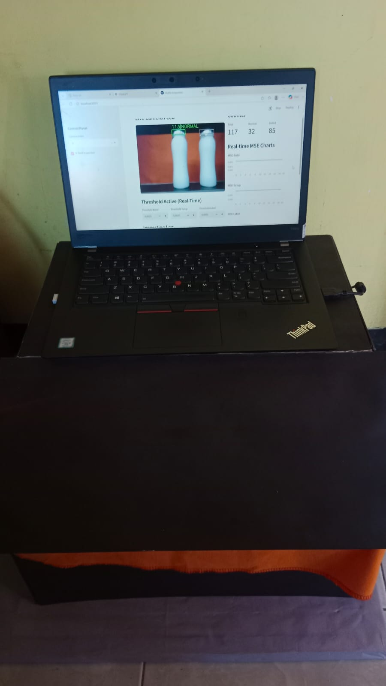
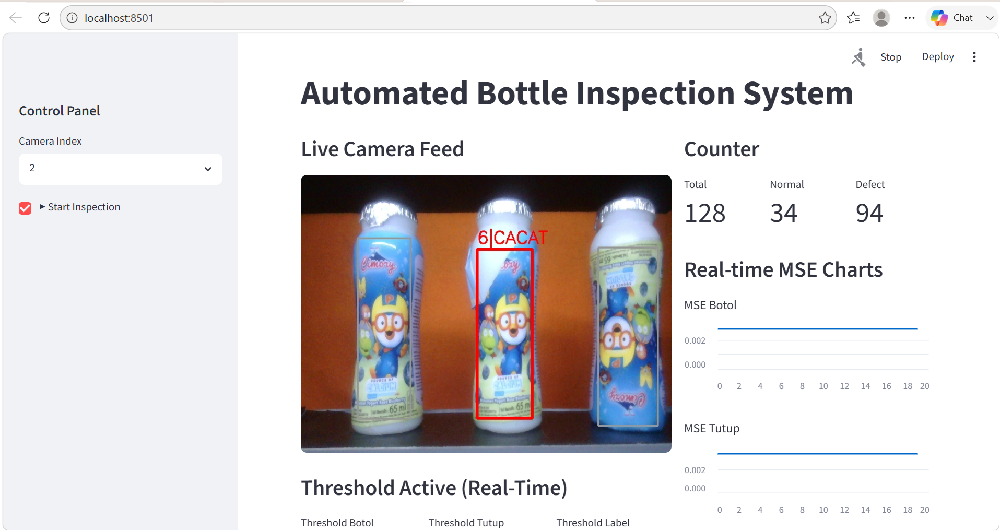
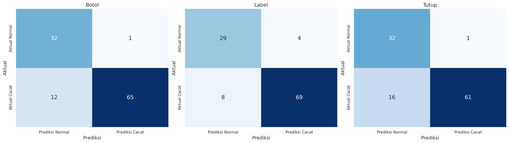

# 🍶 Multi-Object Bottle Defect Detection using YOLOv11 and Convolutional Autoencoder

🎓 Jenis Proyek   : Skripsi S1 Teknik Elektro
🧠 Metode         : YOLOv11 + Convolutional Autoencoder
📷 Input          : Webcam
🥤 Objek          : Botol Cimory Varian Blueberry 65 ml
📄 Bahasa         : Python
🖥️ Dashboard      : Streamlit

---

## 📖 Tentang Proyek

Proyek ini merupakan implementasi sistem inspeksi visual otomatis untuk mendeteksi cacat pada botol menggunakan pendekatan Deep Learning.

Sistem menggabungkan **YOLOv11** untuk mendeteksi lokasi setiap botol pada citra, kemudian setiap botol dipotong (*cropping*) pada setiap komponen botol (badan botol, tutup, dan label), lalu dianalisis menggunakan ***Convolutional Autoencoder*** **(CAE)** berdasarkan tahapan komponen. Keputusan **Normal** atau **Cacat** ditentukan berdasarkan nilai ***Mean Squared Error*** **(MSE)** hasil rekonstruksi citra yang dibandingkan dengan nilai *threshold*. Penentuan *threshold* dilakukan secara empiris dengan mengamati secara *real-time* nilai MSE yang dihasilkan dari pengujian citra botol normal.

Penelitian ini bertujuan untuk membantu proses *quality control* dengan melakukan inspeksi beberapa botol secara bersamaan menggunakan webcam.

---

## 🎯 Latar Belakang

Dalam industri manufaktur, proses inspeksi kualitas produk masih banyak dilakukan secara manual oleh operator. Metode ini memiliki beberapa keterbatasan, seperti kelelahan operator, inkonsistensi hasil inspeksi, serta sulitnya mendeteksi cacat secara cepat dan konsisten pada produk yang diproduksi dalam jumlah besar.

Seiring berkembangnya teknologi ***Computer Vision*** dan ***Deep Learning***, proses inspeksi visual dapat dilakukan secara otomatis untuk meningkatkan efisiensi dan konsistensi hasil inspeksi. Oleh karena itu, penelitian ini mengembangkan sistem inspeksi visual otomatis yang mampu mendeteksi cacat pada botol menggunakan **YOLOv11** dan ***Convolutional Autoencoder*** **(CAE)** dalam satu *pipeline* terintegrasi.

---

## 🎯 Tujuan Penelitian

Tujuan dari proyek ini antara lain:
- Mengembangkan sistem inspeksi visual otomatis untuk mendeteksi cacat pada botol.
- Melakukan deteksi beberapa botol (*multi-object detection*) dalam satu frame menggunakan YOLOv11.
- Mengidentifikasi anomali pada setiap botol menggunakan Convolutional Autoencoder.
- Mengklasifikasikan kondisi botol menjadi normal atau cacat berdasarkan nilai Mean Squared Error (MSE).
- Merancang sistem inspeksi yang dapat digunakan sebagai pendukung proses *quality control* secara *near real-time*.

---

## ✨ Fitur Sistem

Sistem yang dikembangkan memiliki beberapa fitur utama sebagai berikut:
- 📷 Akuisisi citra menggunakan webcam.
- 🥤 Deteksi beberapa botol dalam satu *frame* menggunakan YOLOv11.
- ✂️ *Cropping* otomatis setiap komponen botol hasil deteksi.
- 🧠 Deteksi cacat menggunakan *Convolutional Autoencoder*.
- 📊 Perhitungan nilai *Mean Squared Error* (MSE) sebagai dasar klasifikasi.
- ✅ Klasifikasi kondisi botol menjadi normal atau cacat.
- 🖥️ Visualisasi hasil inspeksi menggunakan Streamlit.

---

## ⚙️ Cara Kerja Sistem

Sistem inspeksi visual terdiri dari beberapa tahapan, mulai dari akuisisi citra hingga klasifikasi kondisi botol. Setiap botol yang terdeteksi dianalisis secara individual menggunakan *Convolutional Autoencoder* berdasarkan nilai *Mean Squared Error* (MSE).

<p align="center">
  
</p>

Secara umum, alur kerja sistem adalah sebagai berikut:
- Akuisisi Citra
  Webcam menangkap citra yang terdapat beberapa botol dalam satu *frame* sebagai *input* model YOLO dengan ukuran 640x480 piksel. Sebelum dilakukan inferensi oleh model YOLO, citra dipreproses secara otomatis menggunakan metode letterbox dengan ukuran input 320×320 piksel untuk mempercepat proses deteksi.
- Deteksi Botol
  YOLOv11 mendeteksi posisi setiap botol dan menghasilkan *bounding box* untuk masing-masing objek pada setiap komponen botol.
- Cropping
  Hasil *bounding box* sebagai acuan untuk *cropping* citra setiap komponen botol sehingga objek dapat dianalisis secara terpisah.
- Preprocessing
  Sebelum masuk ke model *Convolutional Autoencoder* citra hasi *cropping* diubah ukurannya menjadi 128x128 piksel untuk badan botol dan label, serta 64x64 piksel untuk tutup. Selanjutnya, dilakukan normalisasi sebelum masuk ke model CAE.
- Convolutional Autoencoder (CAE)
  *Convolutional Autoencoder* merekonstruksi citra objek, kemudian menghitung nilai *Mean Squared Error* (MSE) antara citra asli dan citra hasil rekonstruksi.
- Threshold
  Nilai MSE tersebut kemudian dibandingkan dengan nilai *threshold* yang telah ditetapkan.
- Klasifikasi
  Apabila nilai MSE melebihi *threshold*, maka botol diklasifikasikan sebagai Cacat. Sebaliknya, apabila nilai MSE berada di bawah *threshold*, maka botol diklasifikasikan sebagai Normal.

---

## 📷 Setup Penelitian

Sistem diuji menggunakan konveyor mini sebagai simulasi proses inspeksi visual. Akuisisi citra dilakukan menggunakan webcam dengan pencahayaan yang dikondisikan selama proses pengambilan data.

<p align="center">
  
</p>

<p align="center">
  
</p>

<p align="center">
  
</p>

<p align="center">
  
</p>

Komponen utama yang digunakan pada sistem meliputi:
- Webcam sebagai perangkat akuisisi citra.
- Konveyor mini sebagai media simulasi pergerakan botol.
- Laptop sebagai perangkat pemrosesan.
- Botol Cimory varian blueberry 65 ml sebagai objek inspeksi.

---

## 🎥 Uji Coba Sistem

Berikut merupakan uji coba sistem saat melakukan inspeksi visual secara *near real-time*.

<p align="center">
  
</p>

Animasi di atas menunjukkan proses deteksi botol menggunakan YOLOv11, dilanjutkan dengan proses klasifikasi kondisi botol menggunakan *Convolutional Autoencoder*.

---

## 📂 Struktur Folder

Berikut adalah struktur direktori utama pada repositori ini.

```text
Multi-Object-Bottle-Defect-Detection/
│
├── assets/
├── dataset/   
├── demo/
├── models/
├── notebooks/
├── results/
├── src/
├── README.md
├── requirements.txt
├── LICENSE
└── .gitignore
```

## 📑 Penjelasan Folder

| Folder / File      | Deskripsi                                                                                                                                               |
| ------------------ | ------------------------------------------------------------------------------------------------------------------------------------------------------- |
| `assets/`          | Menyimpan seluruh aset dokumentasi yang digunakan pada README, seperti diagram pipeline, arsitektur sistem, foto setup penelitian, dan gif uji coba. |
| `dataset/`         | Berisi contoh dataset yang digunakan dalam penelitian beserta dokumentasi singkat mengenai struktur dataset.                                            |
| `demo/`            | Berisi video demonstrasi sistem dan contoh hasil implementasi.                                                                                          |
| `models/`          | Menyimpan model hasil pelatihan, seperti model YOLOv11 dan Convolutional Autoencoder.                                                                   |
| `notebooks/`       | Berisi notebook (`.ipynb`) yang digunakan selama proses pelatihan model dan autocrop citra.                                                 |
| `results/`         | Berisi hasil eksperimen, grafik, confusion matrix, distribusi MSE, serta visualisasi performa sistem.                                                   |
| `src/`             | Berisi seluruh kode sumber aplikasi, termasuk proses deteksi, preprocessing, inferensi model, dan dashboard Streamlit.                                  |                                                                                 |
| `README.md`        | Dokumentasi utama proyek yang menjelaskan latar belakang, metode, struktur folder, serta cara menjalankan sistem.                                       |
| `requirements.txt` | Daftar seluruh pustaka Python yang diperlukan untuk menjalankan proyek.                                                                                 |
| `LICENSE`          | Informasi lisensi penggunaan proyek.                                                                                                                    |
| `.gitignore`       | Daftar file atau folder yang tidak akan diunggah ke Git.                                                                                                |

---

## 📊 Hasil Penelitian

Sistem yang dikembangkan telah melalui proses pelatihan dan pengujian menggunakan dataset botol normal dan botol cacat. Evaluasi dilakukan untuk mengukur performa model deteksi objek (YOLOv11) serta kemampuan *Convolutional Autoencoder* dalam mendeteksi anomali berdasarkan nilai MSE.

### 📈 Metrik Evaluasi

Penelitian ini menggunakan beberapa metrik evaluasi sebagai berikut.

| Metrik                           | Keterangan                                                                          |
| -------------------------------- | ----------------------------------------------------------------------------------- |
| **mAP (Mean Average Precision)** | Mengukur performa model YOLOv11 dalam mendeteksi objek botol                        |
| **Accuracy**                     | Mengukur proporsi total yang benar                                                  |
| **Precision**                    | Mengukur ketepatan sistem dalam melakukan deteksi                                   |
| **Recall**                       | Mengukur kemampuan sistem dalam menemukan seluruh objek yang seharusnya terdeteksi  |
| **F1-Score**                     | mengukur keseimbangan antara precision dan recall                                   |
| **Mean Squared Error (MSE)**     | Digunakan sebagai dasar klasifikasi anomali pada Convolutional Autoencoder          |
| **FPS (Frame Per Second)**       | Mengukur kecepatan sistem saat melakukan inspeksi secara *near real-time*           |

---

### 📷 Contoh Hasil Deteksi

<p align="center">
  
</p>

*Contoh hasil deteksi botol menggunakan YOLOv11 beserta hasil klasifikasi Normal dan Cacat.*

---

### 📉 Distribusi Nilai MSE

<p align="center">
  
</p>

Semakin besar nilai MSE, semakin besar kemungkinan citra tersebut diklasifikasikan sebagai **Cacat**.

---

### 📊 Confusion Matrix

<p align="center">
  
</p>

*Confusion Matrix* digunakan untuk mengevaluasi performa sistem dalam mengklasifikasikan botol menjadi kategori **Normal** dan **Cacat**.

---

### 💡 Ringkasan Hasil

Secara umum, sistem mampu:

* Mendeteksi beberapa botol dalam satu *frame* menggunakan YOLOv11.
* Melakukan analisis setiap botol secara individual menggunakan *Convolutional Autoencoder* .
* Mengklasifikasikan kondisi botol berdasarkan nilai MSE.
* Menjalankan proses inspeksi secara *near real-time* menggunakan webcam.

---

## ⚙️ Instalasi

Ikuti langkah-langkah berikut untuk menjalankan proyek ini pada komputer lokal.

### 1. Clone Repository

```bash
git clone https://github.com/<username>/Multi-Object-Bottle-Defect-Detection.git
```

Masuk ke folder proyek.

```bash
cd Multi-Object-Bottle-Defect-Detection
```

---

### 2. (Opsional) Buat Virtual Environment

Disarankan menggunakan virtual environment agar dependensi proyek tidak bercampur dengan proyek Python lainnya.

Windows

```bash
python -m venv venv
venv\Scripts\activate
```

Linux / macOS

```bash
python3 -m venv venv
source venv/bin/activate
```

---

### 3. Install Seluruh Dependensi

```bash
pip install -r requirements.txt
```

---

## ▶️ Cara Menjalankan Program

Pastikan webcam telah terhubung dan seluruh dependensi telah terpasang.

Jalankan aplikasi menggunakan perintah berikut.

```bash
streamlit run src/appdash.py
```

atau apabila menggunakan file Python utama.

```bash
python src/appdash.py
```

---

## 📁 Model yang Digunakan

Sebelum menjalankan program, pastikan model hasil pelatihan telah tersedia pada folder `models/`.

Contoh struktur folder:

```text
models/
├── best_last.pt
├── cae_model_botol.keras
├── cae_model_label.keras
└── cae_model_tutup.keras
```

---

## 📷 Dataset

Repositori ini hanya menyertakan contoh dataset untuk keperluan dokumentasi.

Apabila ingin melatih model kembali (*retraining*), pengguna perlu menyiapkan dataset sesuai struktur yang digunakan pada penelitian.

---

## 💻 Teknologi yang Digunakan

Proyek ini dikembangkan menggunakan teknologi berikut.

| Teknologi             | Fungsi                                 |
| --------------------- | -------------------------------------- |
| Python                | Bahasa pemrograman utama               |
| YOLOv11 (Ultralytics) | Deteksi objek botol                    |
| TensorFlow / Keras    | Implementasi Convolutional Autoencoder |
| OpenCV                | Pengolahan citra dan webcam            |
| NumPy                 | Komputasi numerik                      |
| Streamlit             | Antarmuka aplikasi                     |
| Matplotlib            | Visualisasi data                       |

---

## 👩‍💻 Penulis

Fitri Nailatul Khobibah
S-1 Teknik Elektro (Konsentrasi Elektronika)
Universitas Hang Tuah, Surabaya

Bidang Minat:
- Computer Vision
- Deep Learning
- Machine Learning
- Embedded AI
- Industrial Automation
- Data Analytics